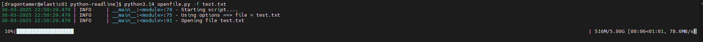

# Python Readline

Use this simple python program to read a file line by line and displaying the time needed to open the file. Useful for testing how fast a file can be read from your disk to determine reading speed.

This program will read your file with encoding utf-8 (replacing unreadable characters with ?), then showing how much time needed to open the file and also how much bytes can be read per second

This program works by reading your file line by line, converting every readed lines into bytes ; then showing progress how long it takes until all bytes are readed

# How to Use

- Install needed libraries

`pip install requirements.txt`

- Create a file sized n GB from /dev/urandom (make sure that your disk size is sufficient)

`dd if=/dev/urandom of=test.txt bs=4M count=1280 status=progress`

- Run the program

`python3 openfile.py -f test.txt`

